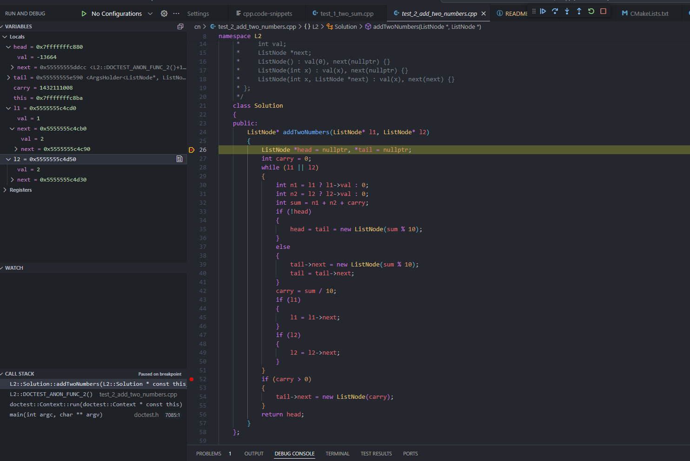

# leetcode-local-debug-template 配置本地调试环境并提交

  
  
## 简介

本项目提供做题模板，用最简单快速的方式去本地调试leetcode。

## 优势：

1. 核心是通过代码模板来进行配置，因此可以跨平台支持jetbrains系列,vscod,neovim 以及其他各种编辑器。即使中途换n次ide，此前写的题目，也可以运行调试。
2. 可以搭配各大编辑器的leetcode 官方插件(jetbrains,vscode,neovim都有）,调试完成后，直接提交答案到leetcode网站。
3. 只需要复制粘贴好 函数参数和测试用例，不需要调整各种输入输出，即可运行。
4. 通过测试框架，将所有solution 集成到同一个项目，不需要一题一个项目。
5. 测试用例直接写在代码里，一次写入，多次运行。还可以搭配版本工具，管理做题进度。
6. 提供基础的框架和工具库（参考这个[项目](https://github.com/zonewave/leetcode-precompiled)），也可以自己替换模块。同时编程新手可以通过此项目学习基本的  “单元测试”，“包管理”，“代码片段”

## 适用范围：
一般情况下，直接写solution 代码，然后通过官方插件，点击直接提交代码到web就可以了。当提交n遍，没通过时，可以利用此模版，复制测试用例到本地，进行调试查看即可方便定位到问题所在。

## 动机

在web刷题 如果在某些题目，遇到一些测试用例特别复杂无法通过，往往定位问会花很长时间。
虽然web 开通会员也能单步调试，但毕竟费钱，而且不是很方便。
因此我想用本地ide来单步调试leetcode，这样定位问题更快。幸运的是，我发现jetbrains系列都有个leetcode-editor插件，通过api，可以本地拉题，编写，提交。唯一的遗憾就是只有默认模版，要进行本地调试，需要一些配置。
后来我调研了网上大部分这块方案，发现都不尽任意，于是就自己动手写了个模版，特此分享出来。

  
  

## 效果

### [Python](./py/README_CN.md)

### gif动图
看不到，可以点击[这里](https://pic.imgdb.cn/item/67078defd29ded1a8c98f822.gif)

  

## 支持的编程语言

- [x] [Python](./py/README.md)

- [x] [Cpp](./cpp/README.md)
- [ ] Golang
- [ ] Java
- [ ] Rust

## 贡献  

欢迎任何形式的贡献！如果您有的改进建议，请提交拉取请求或提出问题。  

## 许可证  

本项目采用 MIT 许可证，详细信息请查看 [LICENSE](https://github.com/zonewave/leetcode-precompiled/blob/master/LICENSE) 文件。  

## 联系信息  

如有疑问，请联系项目维护者。