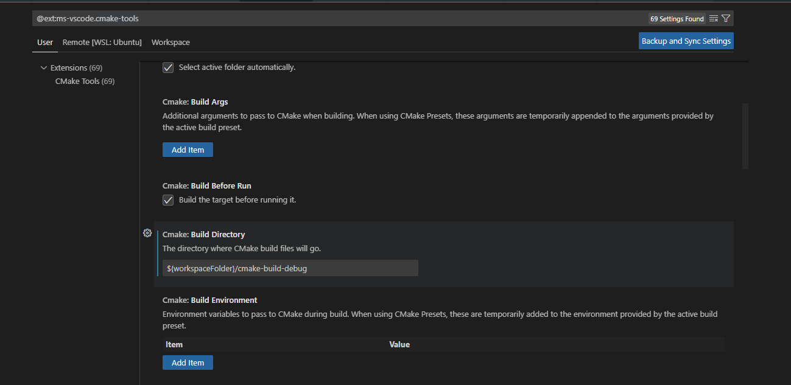
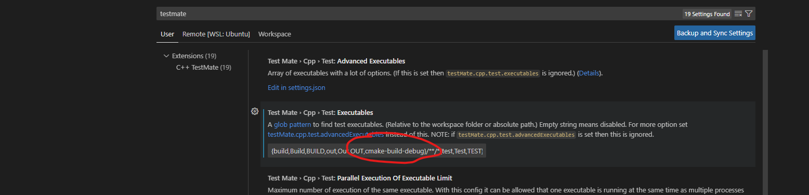

# LeetCode cpp 
欢迎使用 LeetCode cpp  模版


## 效果显示


## 本地环境配置说明
可以直接把项目 git clone 下来，然后用vscode切到cpp文件夹，即可使用
或者把本项目的 cmakelist.txt,test_sources.cmake.in, common文件夹，.vscode里的文件， 复制到自己项目里，也可使用。

主要思路是把每个solution代码纳入到测试体系.
由于cpp标准库里没啥好用的测试库，所以使用doctest了来进行测试运行
本项目需要包管理工具 ，这里使用cmake(后续可能会给xmake,hunter,conan之类的)，vscode,clion 都可以通用

目录结构说明
```
project/
    .vscode
    cmake-build-debug  #构建目录，也可以用build做构建目录名
    cn/  #中文站点
      test_1_two_sum.cpp #解题代码
      ...
    en/ 
      test_1_two_sum.cpp #解题代码
      ...
    common/    #通用目录
    CMakeLists.txt  #cmake 文件
```

## vscode 本地调试
vscode cpp配置 对新手来说，会比较麻烦，但请按下面一步步走
### 1. 安装官方扩展Leetcode 并配置 

参考官方的说明，配置好账号密码

### 2. 安装c++,cmake tool,cmake,c++ testMate 四个扩展

vscode 默认build目录名 是build
如果需要换个build 目录，比如cmake-build-debug，需要改两个地方
设置里 搜索cmake-tools，设定构建目录为 cmake-build-debug，如图下


设置里 搜索testmate，在 excutables 配置 添加 cmake-build-debug，如图下




### 3. 代码路径的配置
settings里搜索leetcode,在filepath 那块打开setting.json,用下面的配置，添加或者替换cpp的文件路径声明

```json
{
  "leetcode.filePath": {
    "cpp": {
      "folder": "cn", //英文站点就用en
      "filename": "test_${id}_${snake_case_name}.cpp"
    }
  },
  "leetcode.useEndpointTranslation": false,
}
```

### 4. [安装工具库](#安装工具库方式)[可选]
写链表，树，嵌套数组时所需的工具库，也可以不安装，自己在common文件里用你自己写的。

### 5. 生成代码片段

点击lc界面里任一题目生成文件后，
在    // @lc code=start 上头空白处 ，敲击lctesth，然后使用tab自动补全，导入头文件和声明命令空间，这里命令空间写题号即可。
在// @lc code=end 下面空白处，敲击lctestb，然后使用tab自动补全，接着补充参数，填写用例。

### 6. 配置测试

编写完测试用例后，需要通过命令面板，执行命令 cmake: build，构建测试。
如果是新增的cpp文件，需要执行 cmake:clean rebuild.

构建之后，界面会出现三角绿色按钮，设置断点，右键即可运行调试。也可以在侧边栏上，


