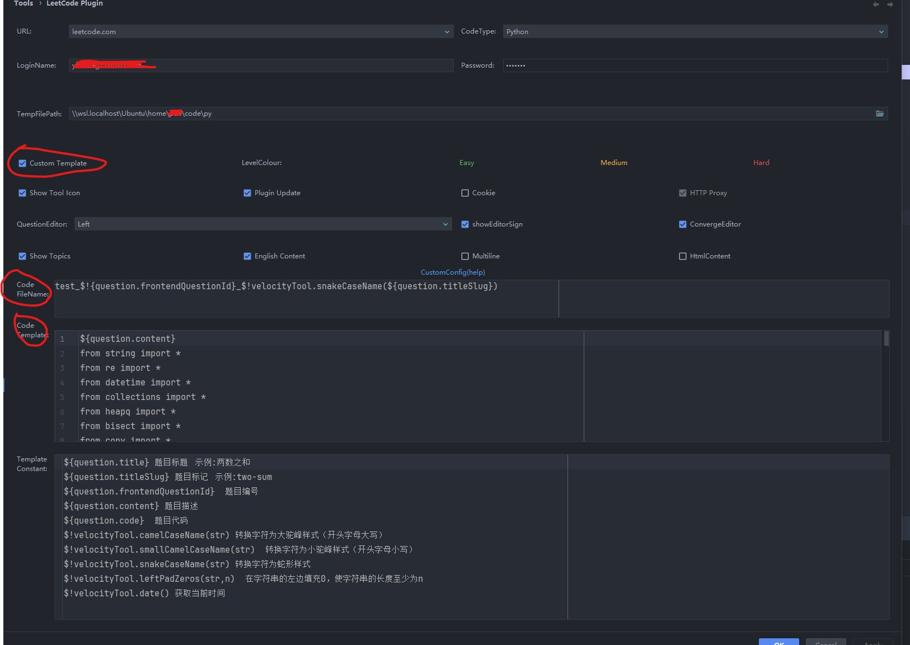
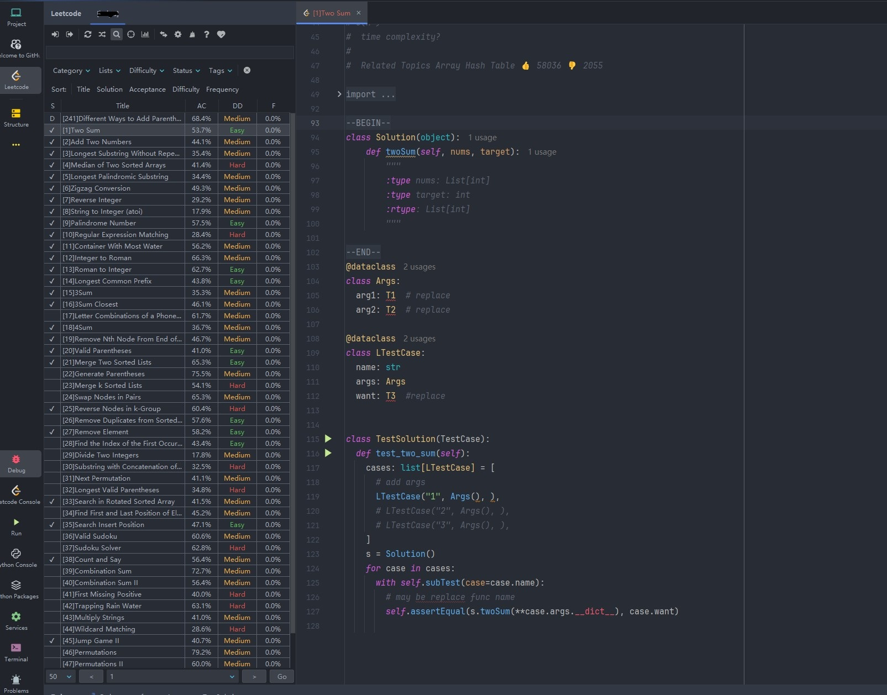
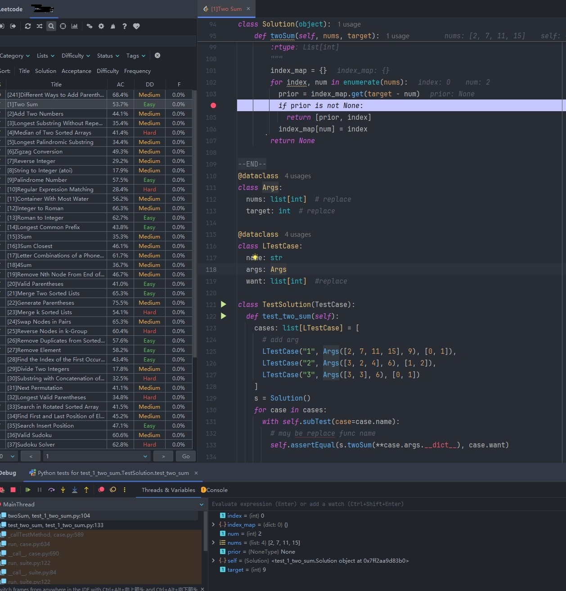
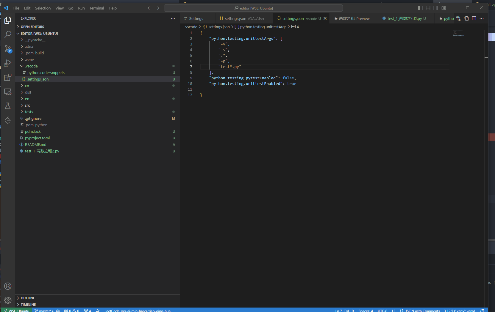

# LeetCode Python 

欢迎使用 LeetCode Python 模版！

[github](https://github.com/zonewave/leetcode-precompiled)

## pycharm 本地调试步骤

### 1. 安装[leetcode-editor](https://github.com/shuzijun/leetcode-editor)

### 2. [安装工具库](#安装工具库方式)

### 3. 配置模板



[模板一](./jetbrain_editor_template.md)
这里除了最后的几行以外， import部分 都是官方web实际运行导入的库

[模板二，推荐](./jetbrain_editor_template2.md)
与模板一不同，这个主要简化了import，可以直接全量导入库，第一个是为了某些时候按需导入其他库，新手默认推荐这个。

### 4.点击题目



### 5. 配置参数和用例，并进行调试



## vscode 本地调试步骤

可以直接clone 本项目，然后打开py文件夹即可加载部分配置。
或者也可以复制py/.vscode 到到自己项目的.vscode也可。
### 1. 安装官方扩展并配置 Leetcode

参考官方的说明，配置好账号密码，这里就不说明

### 2. 代码路径的配置

settings里搜索leetcode,在filepath 那块 打开setting.json,用下面的配置，添加或者替换Python3的文件路径声明

```json
{
  "leetcode.filePath": {
    "python3": {
      "folder": ".",
      "filename": "test_${id}_${kebab-case-name}.py"
    }
  },
  "leetcode.useEndpointTranslation": false,
}
```

### 3. [安装工具库](#安装工具库方式)

### 4. 生成代码片段

点击lc界面里任一题目生成文件后，在空白处，敲击lctest，然后使用tab自动补全，接着像pycharm 那样填参数即可

### 5. 配置unittest测试并断点调试

本模板用的是uniittest框架。
vscode的测试配置，参考微软的[文档](https://vscode.github.net.cn/docs/python/testing#_configure-tests)
写好答案后，点击test界面，运行即可



## 安装工具库方式
precompiled
本库包含

1. leetcode 官方声明的所有数据结构
2. 本地测试所需的各种工具函数 [api说明](#常用数据结构和方法)

目前稳定版本为0.1.8。
可以通过以下命令安装该库：

### bash

``` sh
pip install precompiled  
```  

### pdm

```sh  
pdm add precompiled
```  

## 使用说明

安装完成后，您可以在 Python 代码中使用以下导入语句来访问leetcode所有数据结构：

python

复制

```python  
from precompiled.listnode import ListNode
from precompiled.nestedinteger import NestedInteger
from precompiled.treenode import TreeNode
```  

